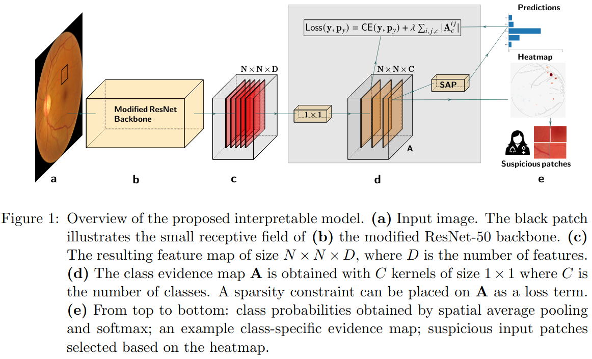

# Sparse Activations for Interpretable Disease Grading
This is the pytorch implementation used in the MIDL 2023 submission [Sparse Activations for Interpretable Disease Grading](https://openreview.net).



## Dependencies
All packages required for running the code in the repository are listed in the file _requirements.txt_

## Data
The code in this repository uses publicly available Kaggle dataset for the [diabetic retinopathy detection challenge](https://www.kaggle.com/c/diabetic-retinopathy-detection/data)

Each image was preprocessed by tightly cropping the circular mask of the retinal fundus and resize to 512 x 512. Then an ensemble of EfficientNets trained on the [ISBI2020 challenge dataset](https://isbi.deepdr.org/challenge2.html) was used to filter out images with low qualities. The resulting dataset used to train and evaluate the model are following: 
- [`training csv file`](./files/csv_files/kaggle_gradable_train.csv)
- [`validation csv file`](./files/csv_files/kaggle_gradable_val.csv)
- [`test csv file`](./files/csv_files/kaggle_gradable_test.csv) 

The images used for figures 2, 3, 4, 6 and 7 are provided in `./files/images`.

## How to use
### Configurations
All experiments are fully specified by the configuration file located at `./configs/default.yaml`. Please adjust paths to dataset in `configs/paths.yaml`.

The folder containing the log file and the final weights of the model can be configured in the function `./utils/func.py -> load_save_paths(params)`

### Run individual configurations

1. Update the training configurations and hyperparameters in `configs/default.yaml`

2. Run an individual configuration <br>
``` $ CUDA_VISIBLE_DEVICES=x python main.py ```
3. Monitor the training progress with tensorboard on 127.0.0.1:6006 by running: <br>
```$ tensorborad --logdir=/path/to/your/log --port=6006```

### Reproducibility
- `Evaluations.ipynb` contains the [paper's](https://openreview.net) code for figures 2, 3, 4, 6, and 7.
- Annotation masks may be available upon request.

### Best models's weights
The final models with the best validation weights used for the experiments (also in `Evaluations.ipynb`) are available
- [Binary referable denseBagNet model](https://drive.google.com/file/d/1xW4w04LDoOxvmU8ziwTvdALQU9i6UROC/view?usp=share_link)
- [Binary referable sparseBagNet model](https://drive.google.com/file/d/145h-2_HkA_S085OFTl1pN-8LI9ss-tET/view?usp=share_link)
- [Binary referable ResNet model](https://drive.google.com/file/d/1sVbANGkb0Tzgqh_5JrnPlG9ioVQKgmlw/view?usp=share_link)
- [Multiclass denseBagNet model](https://drive.google.com/file/d/1lQWMtnq1OQvKT_EVqDagCHGedXcCcbl_/view?usp=share_link)
- [Multiclass sparseBagNet model](https://drive.google.com/file/d/1rUxN1lAiyBZgjmqtozvbRDEwllwApHVM/view?usp=share_link)
- [Multiclass resnet model](https://drive.google.com/file/d/1_okXGC90rGAYSL2OXYdKUmq2ETX2TmA4/view?usp=share_link)

## Acknowledge
We greatly thanks the reviews of MIDL 2023 for improving this work.

## Citation
If you use this code, please cite
```
 @inproceedings{donteu2023sparse,
  title={Sparse Activations for Interpretable Disease Grading},
  author={Donteu, Kerol R Djoumessi and Ilanchezian, Indu and K{\"u}hlewein, Laura and Faber, Hanna and Baumgartner, Christian F and Bah, Bubacarr and Berens, Philipp and Koch, Lisa M},
  booktitle={Medical Imaging with Deep Learning},
  year={2023}
}
```
